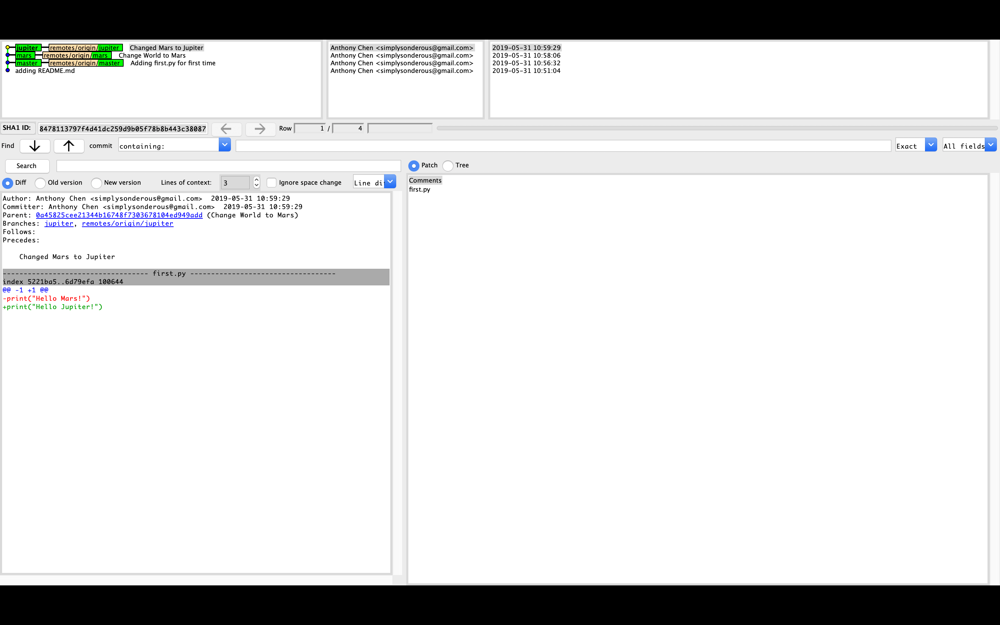
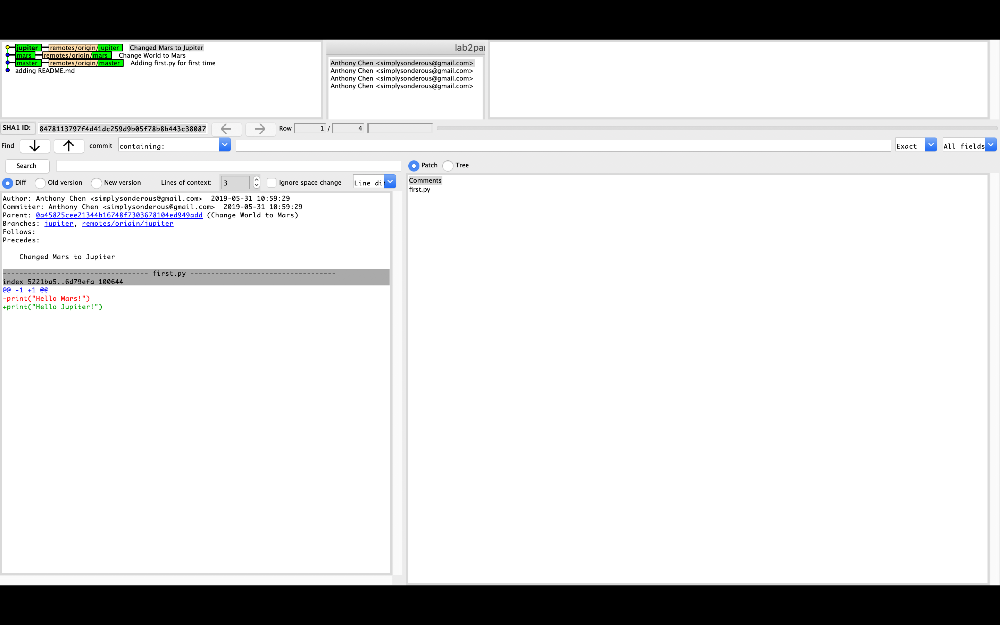
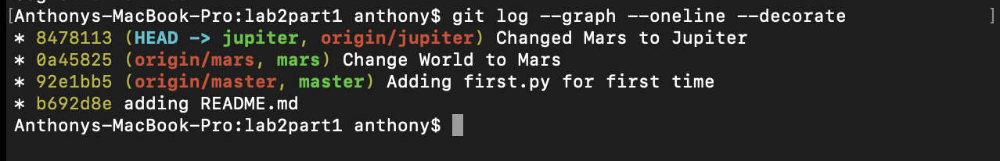
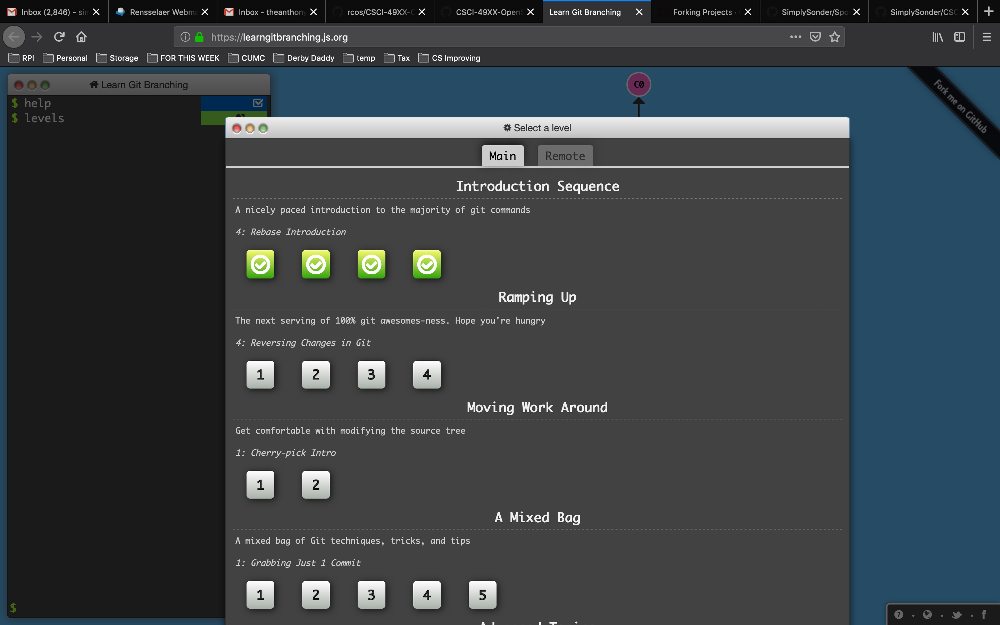
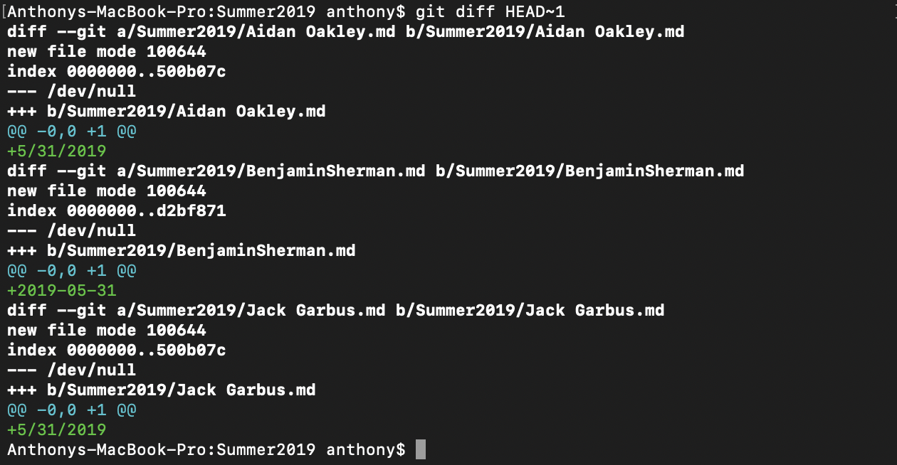
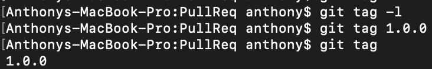

# Part 1
### 1-2
https://github.com/SimplySonder/CSCI4961_Lab2

### 3-6

# Part 2
### 1-3
https://github.com/SimplySonder/CSCI4961_lab2part1
### 4

# Part 3
### 1
https://github.com/SimplySonder/PullReq
### 2

### 3

### 5
https://github.com/beshaz/OSSProjectIdeas
