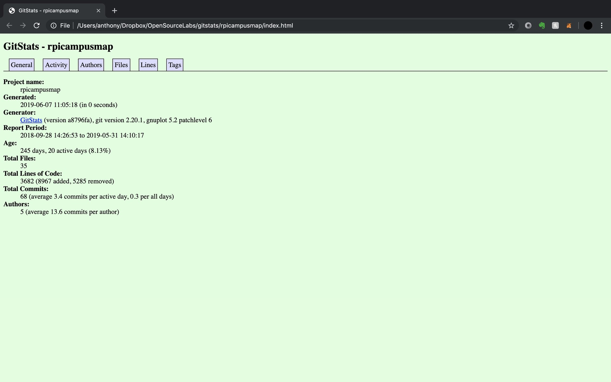
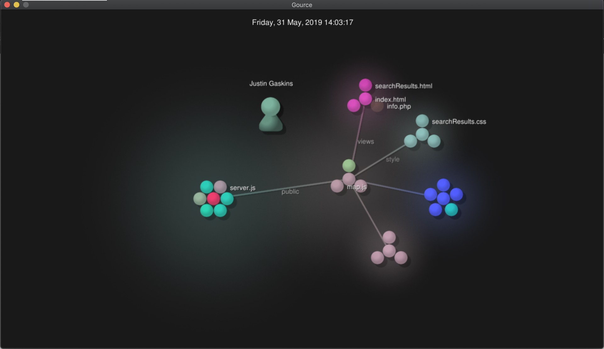
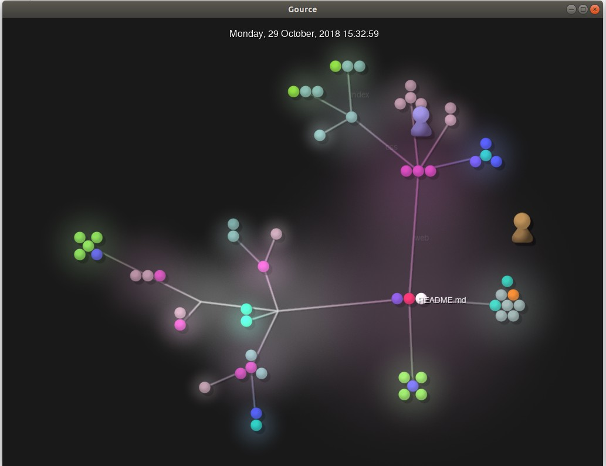
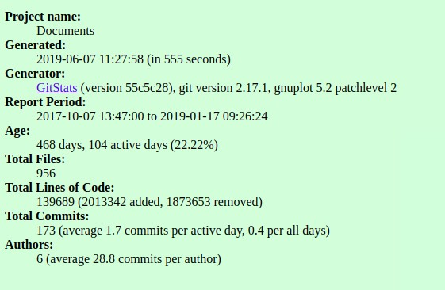
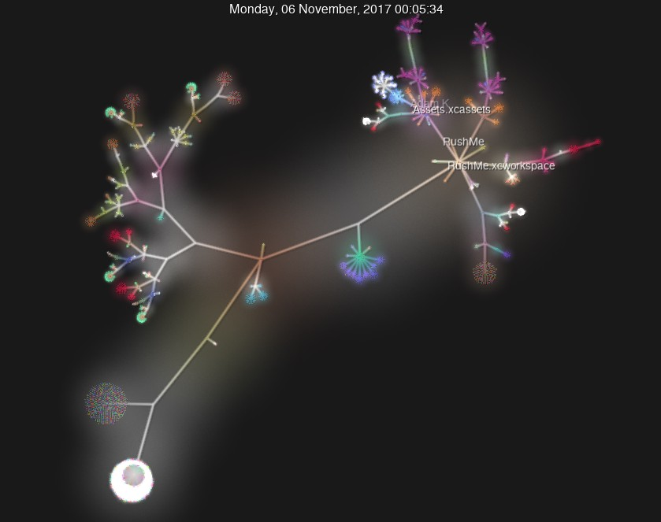
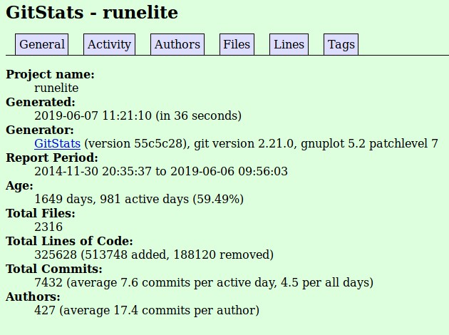
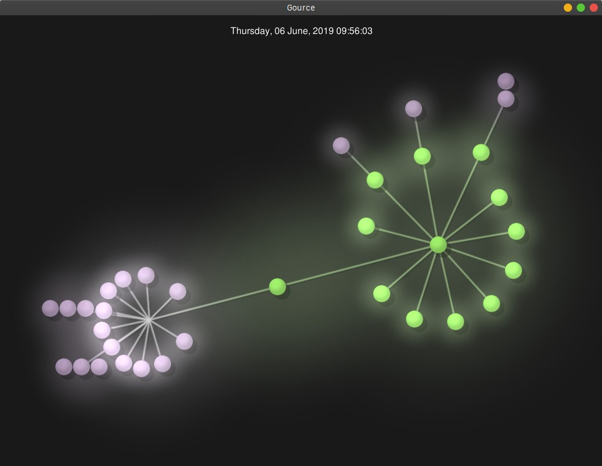

# Part 1 - Documentation

# Part 2 - Community
### RPI Campus Map
##### Number of contributors
4
##### Number of lines of code
18198
##### First commit
Sep 28, 2018
##### Latest commit
Mar 26, 2019 
##### Current branches
5

### RPI Campus Trends Repo Data:
##### Number of Contributors: 
5
##### Lines of Code: 
181,974
##### First Commit: 
9/2/18
##### Last Commit: 
4/17/19
##### Current Branches: 
2 (master and flask-refractor)

### RushMeiOS 
##### Contributors: 
3 
##### Lines of code: 
549,515 
##### First commit: 
Sat Oct 7 13:47:00 2017 
##### Last commit: 
Thu Jan 17 09:26:24 2019 
##### Branches: 
11 
Cam Chat ErrorSystem NewLook Notifications SaveFrats calendar changes-jim favorites linted-version master

### Runelite 
##### Contributors: 
334 
##### Lines of code: 
48074
##### First commit: 
6/6/2019 9:56 PM 
##### Last commit: 
11/30/2014 8:35 PM
##### Branches: 
1 (master)

