### Example 0
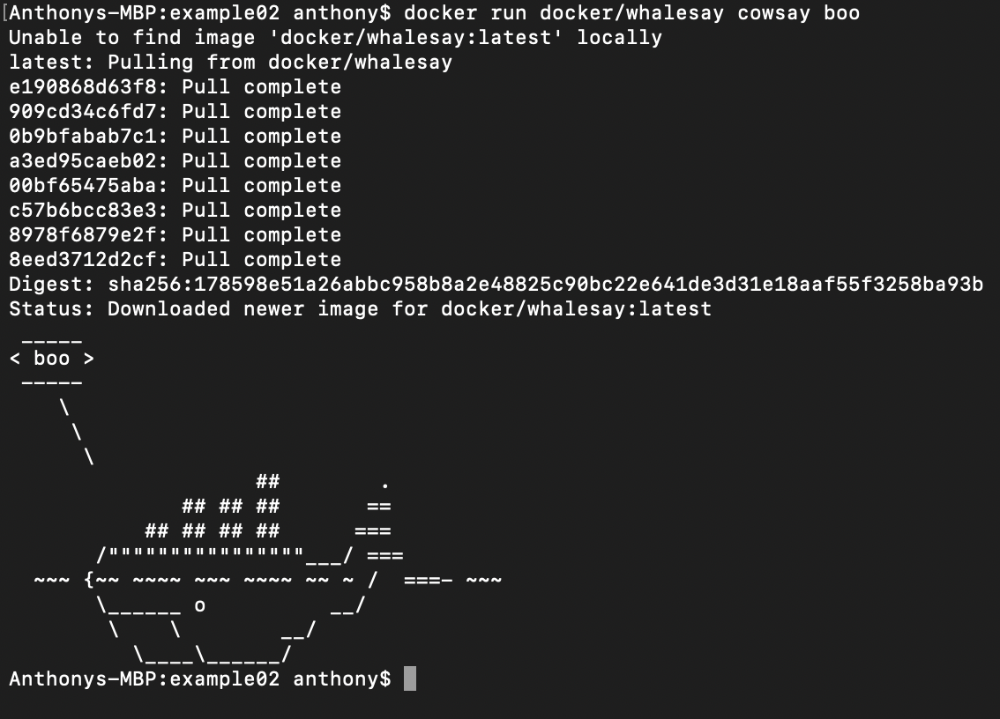
### Example 1
##### Running the Ubuntu container
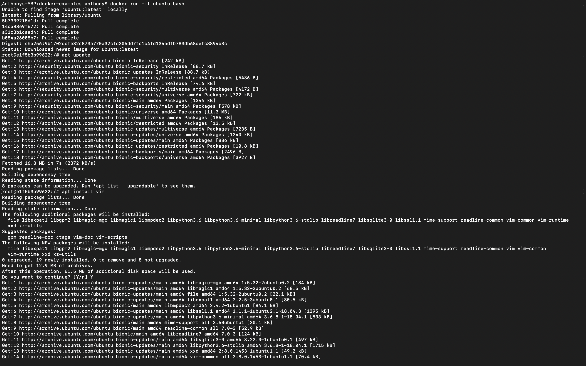
##### Installing Vim
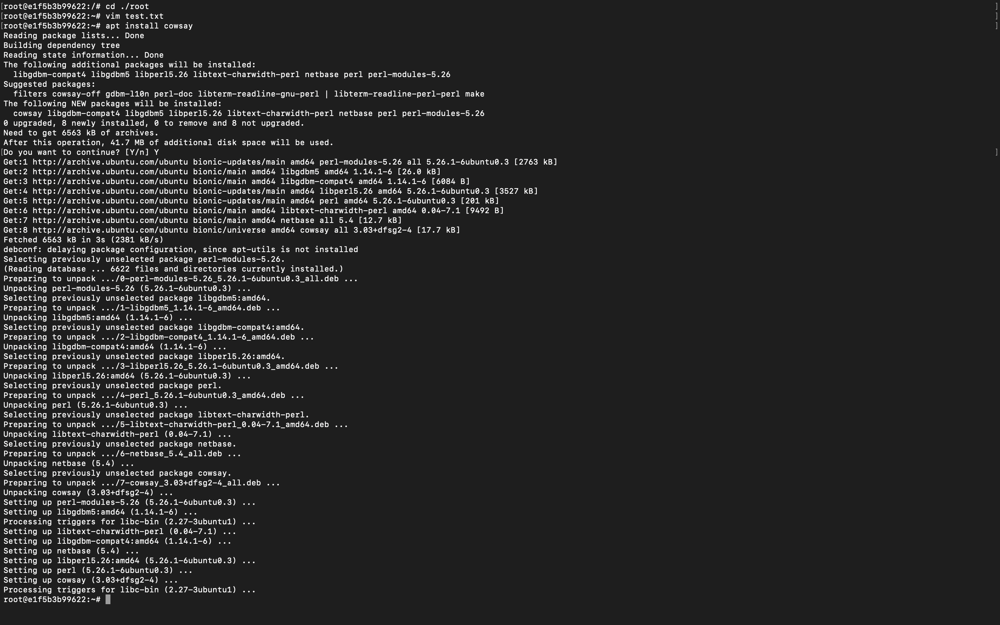
##### Installing Cowsay
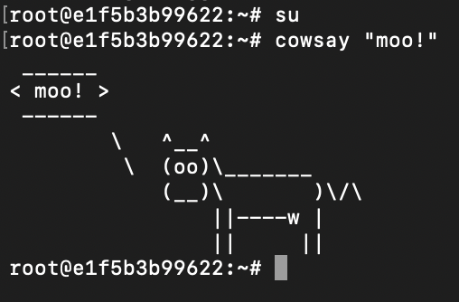
### Example 2
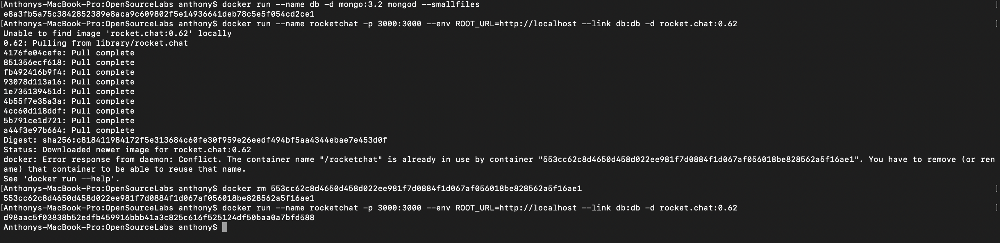
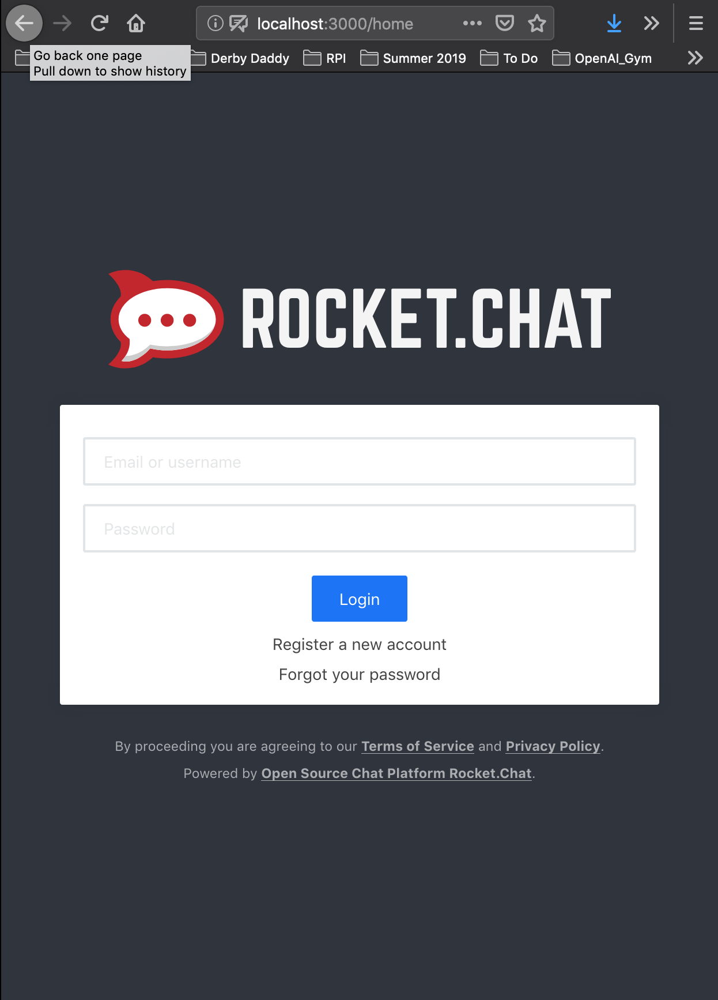
### Example 3
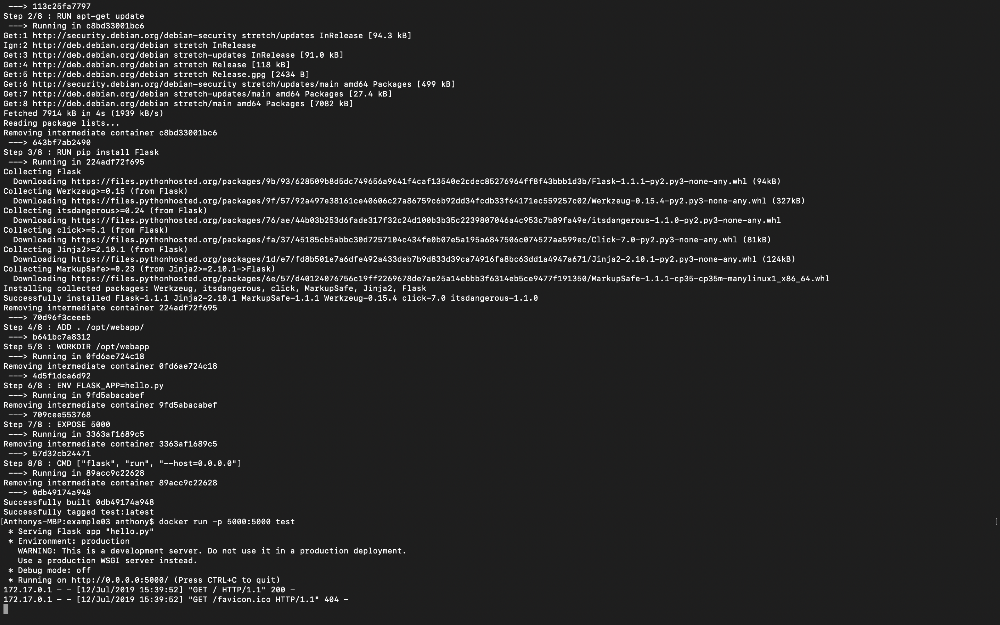
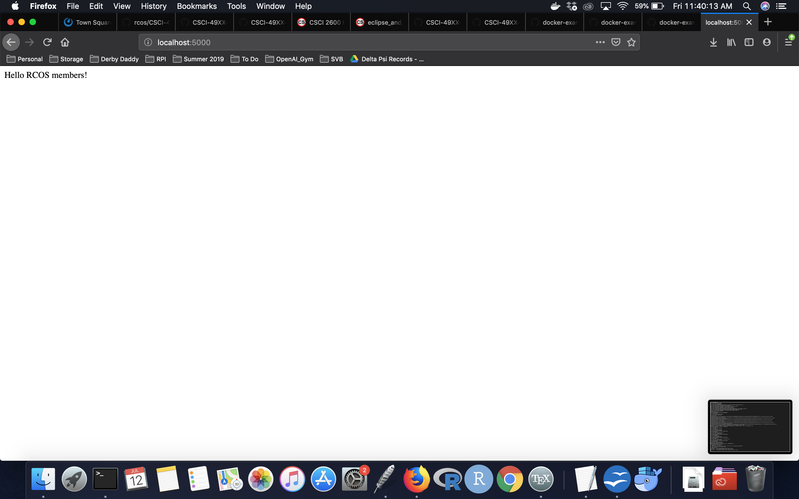
### Example 4
##### Set up
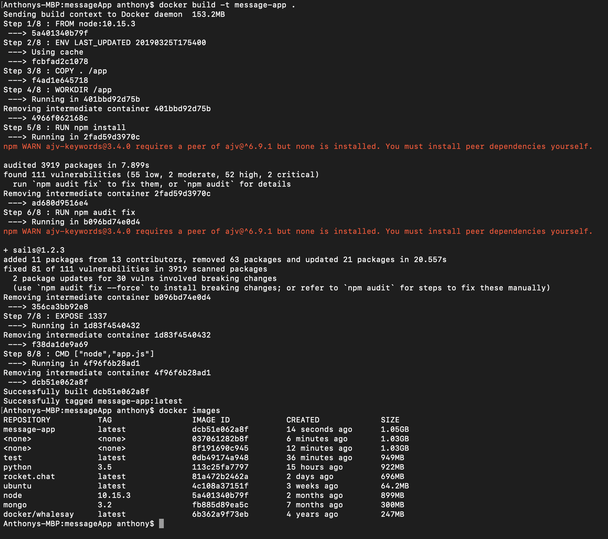
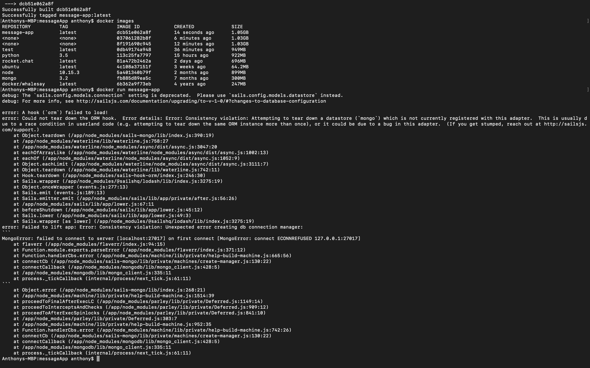
##### Running
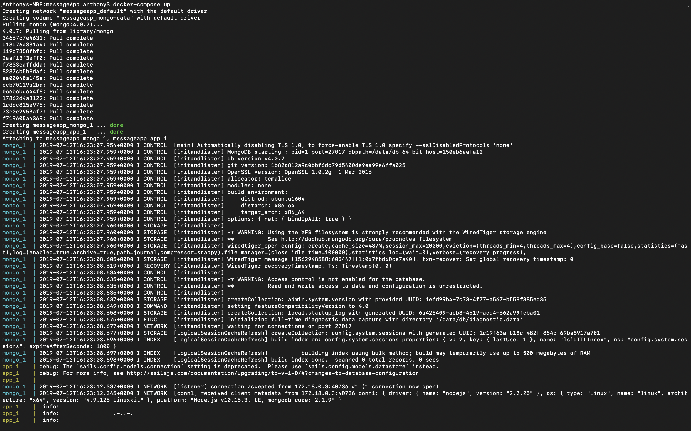
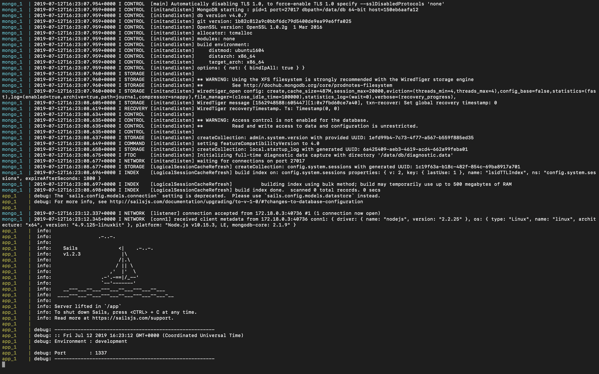
##### Using the app
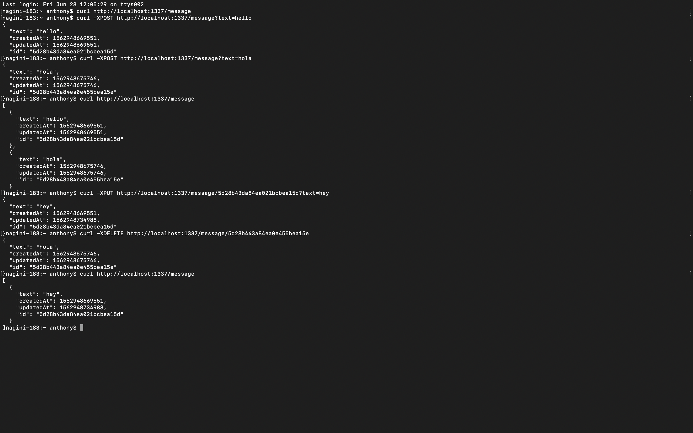
